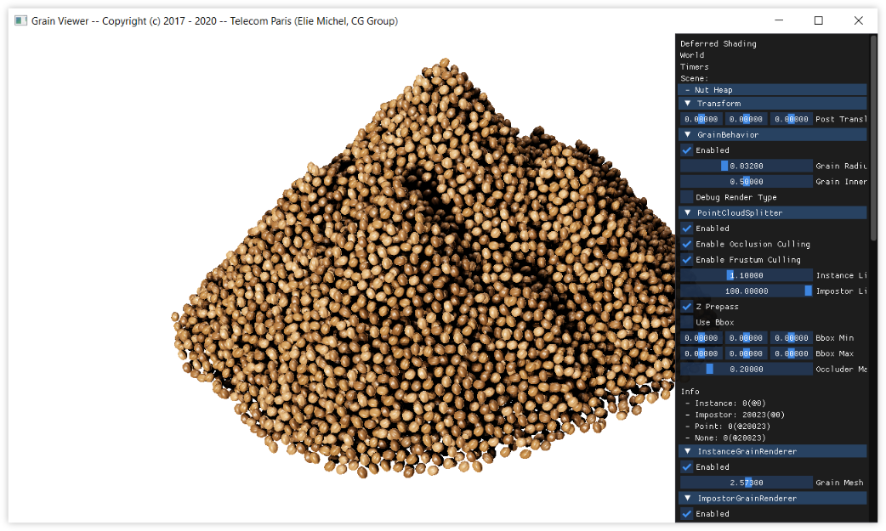

Grain Viewer
============



### About

This is the official implementation of the research paper *"Real-time multiscale rendering of dense dynamic stackings"* by Élie Michel and Tamy Boubekeur, published in Computer Graphics forum (Pacific Graphics).

```
@article{Michel_Boubekeur:2020,
	author = {Michel, {\'{E}}. and Boubekeur, T.},
	title = {Real Time Multiscale Rendering of Dense Dynamic Stackings},
	journal = {Computer Graphics Forum},
	volume = {39},
	number = {7},
	pages = {?-?},
	doi = {?},
	url = {https://onlinelibrary.wiley.com/doi/abs/?},
	eprint = {https://onlinelibrary.wiley.com/doi/pdf/?},
	year = {2020}
}
```

## Installation

If you are only interested in running the software, download a precompiled release from the [last release page](https://github.com/eliemichel/GrainViewer/releases/latest).

To build from source, git clone this repository as usual, don't forget submodules, then use cmake as usual. See `build-*` scripts for reference. More detailed build instructions can be found in [doc/build-instructions.md](doc/build-instructions.md).

## Usage

Example scenes can be found in [share/scenes](share/scenes). To use these, you will need to download additional binary data using the `download-data.bat` or `download-data.sh` script.

For detailed end user instruction, please refer to the [doc/user-manual.md](doc/user-manual.md) file.

## Troubleshooting

If you are encountering any difficulty building or using this project and could not find a fix in the documentation and in particular in the [doc/troubleshooting.md](doc/troubleshooting.md) file, please fill in an issue in the [bug tracker](https://github.com/eliemichel/GrainViewer/issues).

## License

All the original code from GrainViewer is released under the MIT license. See individual license files for dependencies.

```
Copyright (c) 2017 - 2020 -- Télécom Paris (Élie Michel <elie.michel@telecom-paris.fr>)

Permission is hereby granted, free of charge, to any person obtaining a copy
of this software and associated documentation files (the “Software”), to
deal in the Software without restriction, including without limitation the
rights to use, copy, modify, merge, publish, distribute, sublicense, and/or
sell copies of the Software, and to permit persons to whom the Software is
furnished to do so, subject to the following conditions:

The above copyright notice and this permission notice shall be included in
all copies or substantial portions of the Software.

The Software is provided “as is”, without warranty of any kind, express or
implied, including but not limited to the warranties of merchantability,
fitness for a particular purpose and non-infringement. In no event shall the
authors or copyright holders be liable for any claim, damages or other
liability, whether in an action of contract, tort or otherwise, arising
from, out of or in connection with the software or the use or other dealings
in the Software.
```
