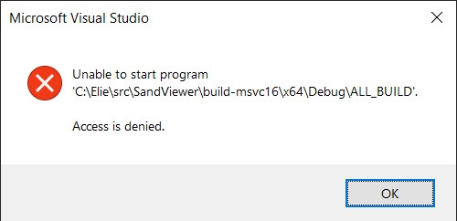

## Troubleshooting

This is a list of common issues. If you are encountering any difficulty that is not already listed here, please fill in an issue in the [bug tracker](https://github.com/eliemichel/GrainViewer/issues).

### Unable to start

When using Visual Studio, if you encounter this error dialog when trying to run the solution generated by CMake:

Right click on *GrainViewer* in the solution explorer (right panel, in default Visual Studio window layout) and chose "Set as StartUp Project".
